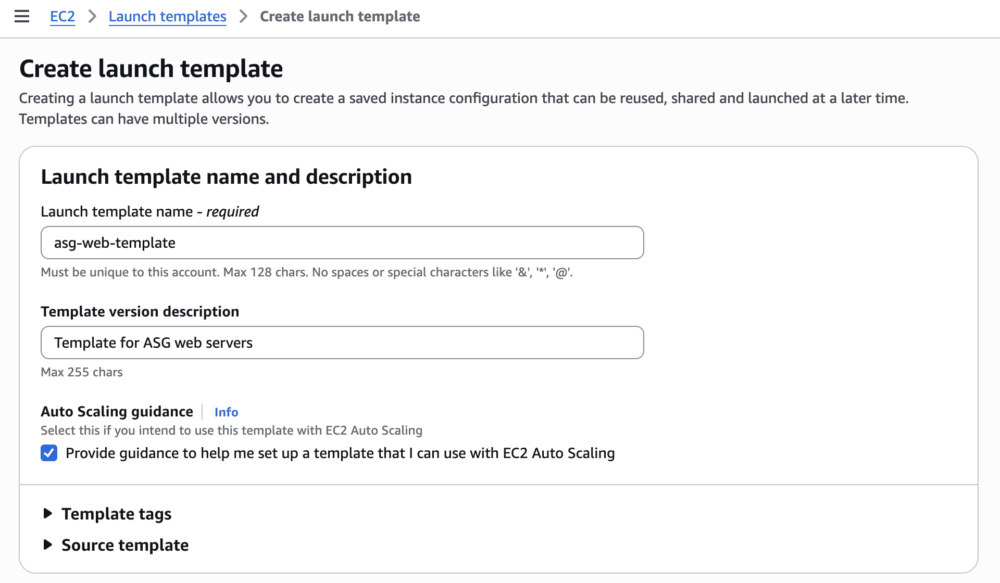
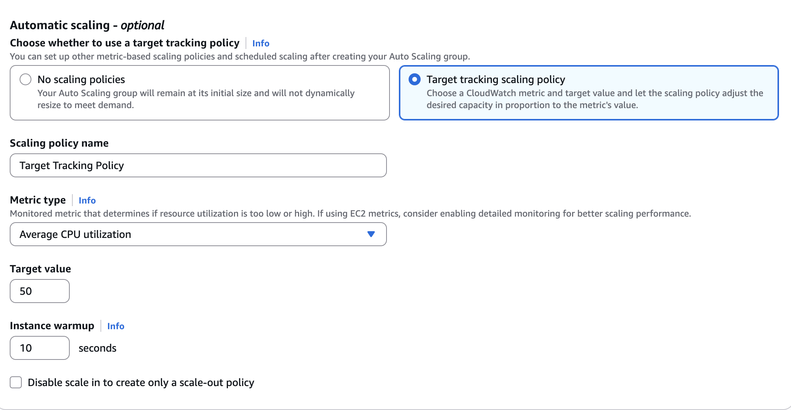
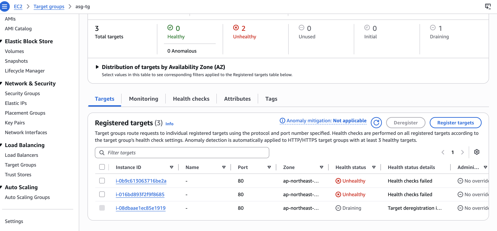
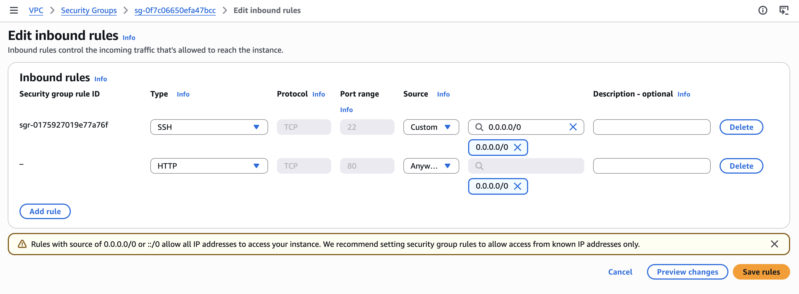
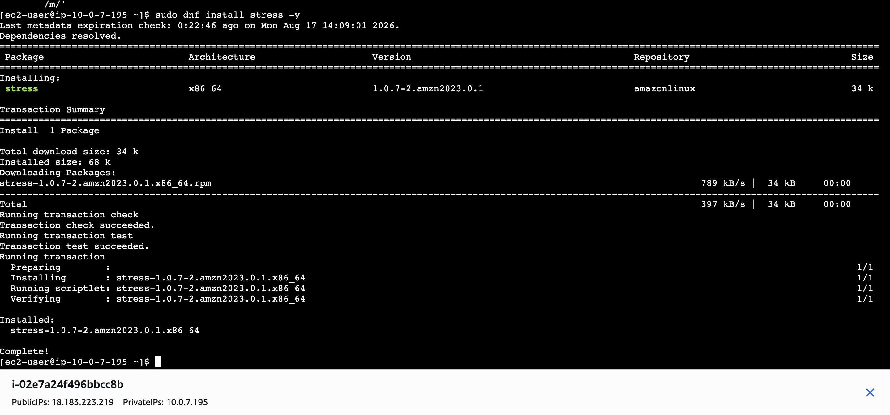
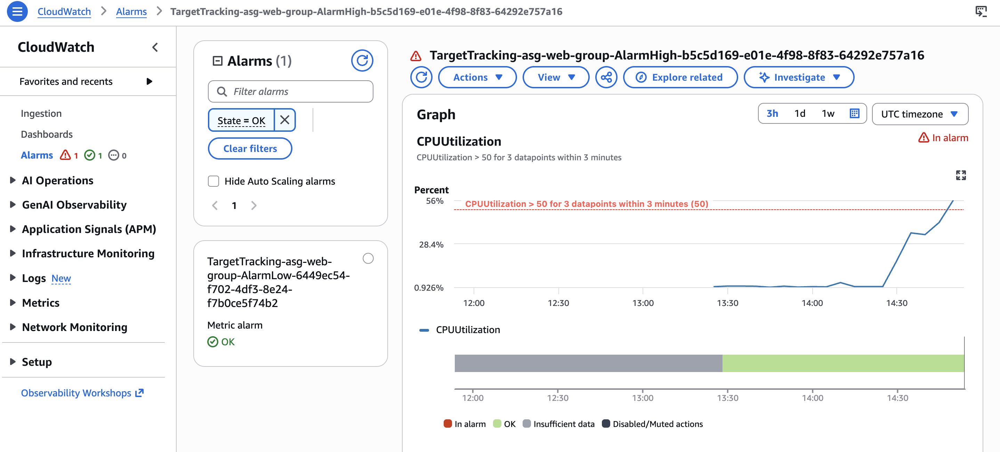
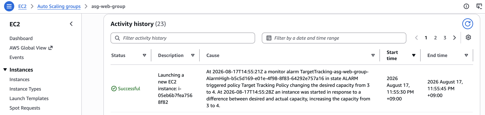
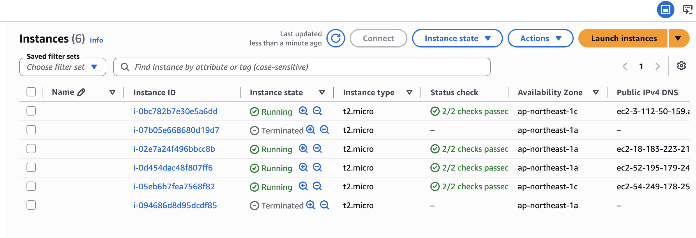

#  AWS High-Availability Web Infrastructure: Auto Scaling & ALB

This repository documents the end-to-end deployment, real-world troubleshooting, and stress-testing of a highly available web architecture on AWS. The project utilizes an **Application Load Balancer (ALB)** to distribute traffic across a dynamic pool of EC2 instances managed by an **Auto Scaling Group (ASG)**, with automated scaling policies triggered by **Amazon CloudWatch**.

---

##  Architecture Overview
* **VPC:** Custom VPC across 2 Availability Zones for high availability.
* **Auto Scaling:** Dynamic scaling (Min: 2, Max: 4) based on Target Tracking Policy (<= 50% CPU).
* **Load Balancing:** Internet-facing ALB routing traffic to healthy EC2 targets.
* **Automation:** EC2 instances are bootstrapped using User Data to install Apache and serve dynamic metadata (Private IP).

---

##  1. Initial Configuration

Setting up the foundational rules for how instances should be launched and scaled.

**Launch Template Setup:** Configuring the base AMI, instance type (`t2.micro`), and User Data script.

**Auto Scaling Policy:** Implementing a Target Tracking Policy to ensure the ASG automatically scales out when average CPU utilization hits 50%.

---

##  2. Real-World Troubleshooting (CSE Focus)

In real-world cloud environments, misconfigurations happen. Here is how network and security issues were diagnosed and resolved during deployment.

### Issue A: Instances Failing Health Checks (Network Layer)
* **Symptom:** The Target Group reported instances as **Unhealthy**.
* **Root Cause:** Instances were launched in a subnet without a NAT Gateway and lacked Public IPs, preventing the User Data script from reaching the internet to install Apache.

* **Resolution:** Enabled `Auto-assign public IPv4 address` on the subnets and replaced the instances.

* **Result:** Instances successfully bootstrapped, passed the AWS `2/2 status checks`, and automatically registered as Healthy to serve traffic.

### Issue B: Connection Timeouts (Security Layer)
* **Symptom:** Website failed to load via ALB DNS, and SSH connections timed out.
* **Root Cause:** Security Group inbound rules were incorrectly restricting `HTTP` and `SSH` access.
* **Resolution:** Modified the Web Security Group to accept `0.0.0.0/0` (Anywhere IPv4) for critical ports during testing.

---

## 3. Stress Testing & Auto Scaling Verification

To validate the elasticity of the architecture, a synthetic load was generated on one of the instances to force a scale-out event.

**Initiating the Load:** Using the `stress` utility to push CPU utilization to 100% for 10 minutes.

**CloudWatch Alarm Triggered:** CloudWatch successfully detected the CPU spike over 3 consecutive data points, transitioning the alarm to **In alarm** state.

**ASG Activity (Scale-Out):** Reacting to the CloudWatch alarm, the ASG dynamically launched new instances, stepping up the capacity from 2 -> 3 -> 4.

**Max Capacity Reached:** The EC2 dashboard confirms all 4 instances (the maximum limit) were successfully provisioned and running.

---

##  4. Load Balancer Distribution Validation

With 4 instances running, refreshing the ALB's DNS URL demonstrated successful load balancing. The ALB routed HTTP requests across different availability zones and instances, confirmed by the varying Private IPs displayed on the web page.

**Routing to Instance A:**

**Routing to Instance B:**

---
*Project completed as a practical demonstration of AWS infrastructure deployment, monitoring, and cloud troubleshooting.*
