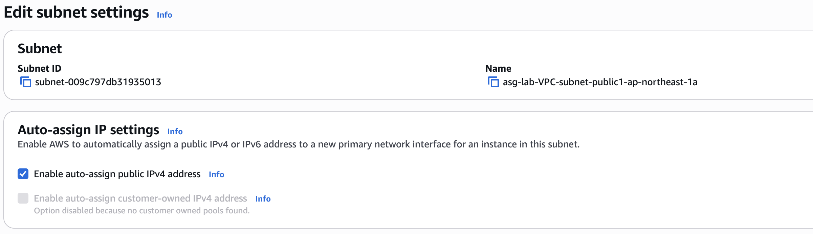
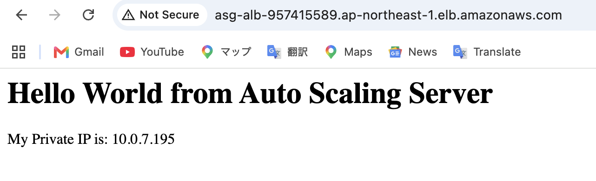
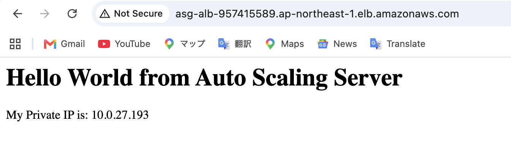

[English Version](./README.md)

#  AWS高可用性ウェブインフラ：Auto Scaling & Application Load Balancer

本リポジトリは、AWS上に構築された高可用性ウェブアーキテクチャの端から端までのデプロイ、トラブルシューティング、およびストレステストの実績を記録したものです。本プロジェクトでは、**Application Load Balancer (ALB)** を使用して、**CloudWatch** アラームによって自動スケーリングされる **Auto Scaling Group (ASG)** 内のEC2インスタンス群へトラフィックを適切に分散します。

---

## アーキテクチャの概要
* **VPC:** 高可用性を確保するため、2つのアベイラビリティゾーン（AZ）に跨るカスタムVPCを構築。
* **Auto Scaling:** Target Tracking Policy (CPU使用率 <= 50%) に基づく動的スケーリング（最小: 2、最大: 4）。
* **Load Balancing:** 正常なEC2ターゲットへトラフィックをルーティングするインターネット向けALB。
* **Automation:** User Data スクリプトを使用してApacheを自動インストールし、動的メタデータ（プライベートIP）を表示。

---

## 1. 初期設定 (Initial Configuration)

インスタンスの起動およびスケーリングの基本ルールを設定。

**Launch Template の作成:** ベースAMI、インスタンスタイプ (`t2.micro`)、および User Data スクリプトを設定。

**Auto Scaling Policy の設定:** 平均CPU使用率が50%に達した際にASGが自動的にスケールアウトするように Target Tracking Policy を適用。

---

## 2. トラブルシューティング (CSE Focus)

実際のクラウド環境では設定ミスが発生することがあります。本フェーズではデプロイ時に発生したネットワークおよびセキュリティの問題を特定・解決しました。

### 課題 A: インスタンスのヘルスチェック失敗（ネットワーク層）
* **事象:** Target Group でインスタンスが **Unhealthy** と表示される。
* **原因:** NAT Gateway のないサブネットでパブリックIPが割り当てられずに起動したため、User Data スクリプトがインターネットに接続できず Apache のインストールに失敗した。

* **解決策:** サブネットの `Auto-assign public IPv4 address`（パブリックIPv4のアセット自動割り当て）を有効化し、インスタンスを再起動。

* **結果:** インスタンスが正常にブートストラップされ、AWSの `2/2 status checks` をパスして Target Group に **Healthy** として登録された。

### 課題 B: 接続タイムアウト（セキュリティ層）
* **事象:** ALBのDNS経由でウェブサイトにアクセスできず、SSH接続もタイムアウトする。
* **原因:** Security Group のインバウンドルールで `HTTP` および `SSH` アクセスが適切に許可されていなかった。
* **解決策:** テスト用に Web Security Group のインバウンドルールを修正し、`0.0.0.0/0` (Anywhere IPv4) からのトラフィックを許可。

---

## 3. ストレステストと Auto Scaling の検証

アーキテクチャの弾力性（Elasticity）を検証するため、インスタンス上で人工的な負荷を生成してスケールアウトイベントを発生させました。

**負荷の生成:** `stress` ユーティリティを使用して、CPU使用率を10分間100%に引き上げる。

**CloudWatch アラームの発生:** 3回連続してCPU急増を検知し、CloudWatch アラームが **In alarm** 状態へ遷移。

**ASG の動的スケールアウト:** アラームを受信したASGが動的にインスタンスを追加し、容量を 2 -> 3 -> 4 へと拡大。

**最大容量への到達:** EC2ダッシュボードにて、設定した最大上限である4台のインスタンスがすべて正常起動していることを確認。

---

## 4. Load Balancer トラフィック分散の検証

4台のインスタンスが稼働している状態で、ALBのDNS URLをリフレッシュし、負荷分散を検証しました。ALBはリクエストを異なるAZへルーティングし、ウェブページ上に表示されるプライベートIPが切り替わることで、4台すべてに分散されていることを確認しました。

**インスタンス 1 へのルーティング:**

**インスタンス 2 へのルーティング:**

**インスタンス 3 へのルーティング:**

**インスタンス 4 へのルーティング:**

---
*AWSインフラストラクチャのデプロイ、モニタリング、およびクラウドトラブルシューティングの実践デモとして完了。*
